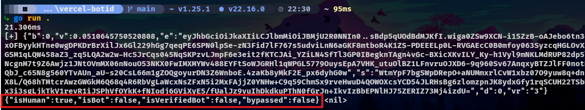

# Vercel BotID Solver / "X-Is-Human" Header (basic mode)


<br>

---

## Overview

This project provides a Golang-based solver for the Vercel BotID challenge.
It uses go-fAST to deobfuscate and then extract every value required. (blazingly fast)

---

# ⭐ Show your Support

Please star the repository if you find it useful! Your support helps improve the project. ❤️

---

## Installation

```
go get github.com/xkiian/vercel-botid && go mod tidy
```

## Usage

```go
package main

import (
	"fmt"
	"log"
	"github.com/xkiian/vercel-botid/botid"
)

func main() {
	solver, err := botid.NewBotID("SCRIPT URL HERE (see tutorial for help)")
	if err != nil {
		log.Fatal(err)
	}

	token, err := solver.GenerateToken()
	if err != nil {
		log.Fatal(err)
	}
	fmt.Println("Generated BotID Token:", token)
}
```

## License

This project is licensed under the MIT License - see the [LICENSE](LICENSE) file for details.

---

## Disclaimer

This package is **unofficial** and not affiliated with Vercel. Use it responsibly and in accordance with AWS's terms of
service.

